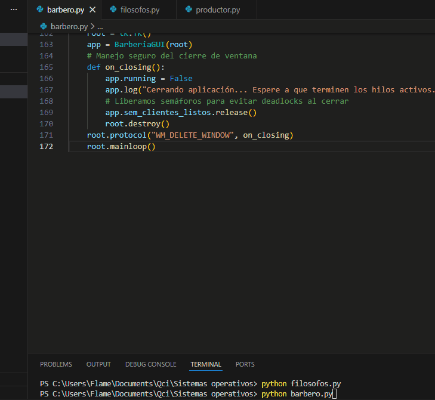
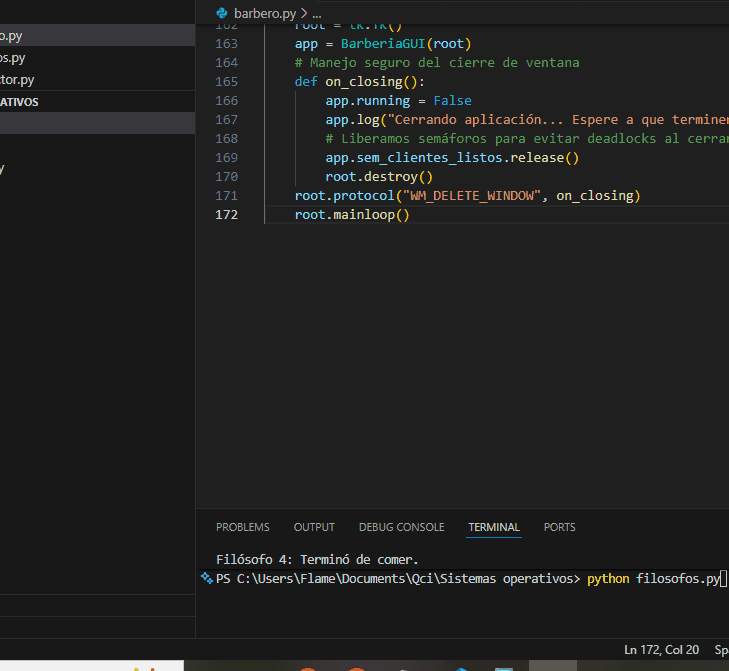
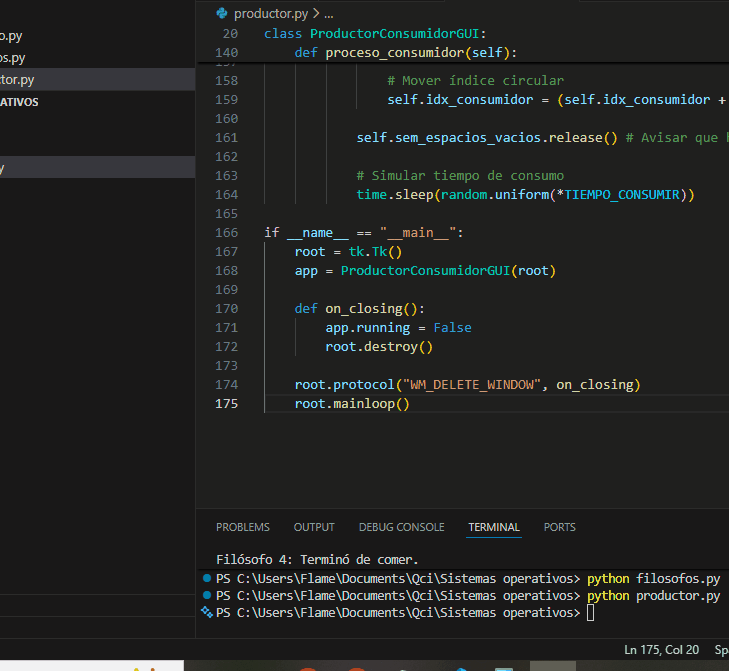

# Problemas Clásicos de Concurrencia (Python + Tkinter)

Implementación visual de los problemas clásicos de sincronización de Sistemas Operativos utilizando **Semáforos**, **Mutex** y **Monitores** en Python.

## 🛠 Tecnologías
* **Lenguaje:** Python 3.x
* **GUI:** Tkinter
* **Conceptos:** Multi-hilos (Threading), Locks, Semáforos, Deadlock prevention.

## 1. El Barbero Dormilón 💈
Solución al problema de capacidad finita y coordinación servidor-cliente.
* **Estado:** ✅ Resuelto
* **Visualización:**

## 2. La Cena de los Filósofos 🍝
Implementación con **Jerarquía de Recursos** para prevenir *Deadlocks* (Interbloqueos).
* **Estado:** ✅ Resuelto (Sin Deadlocks)
* **Visualización:**

## 3. Productor - Consumidor 🏭
Simulación de buffer acotado (Cola Circular) con manejo de estados de espera (Empty/Full).
* **Estado:** ✅ Resuelto
* **Visualización:**

---
**Autor:** [Daniel Gaitan] -